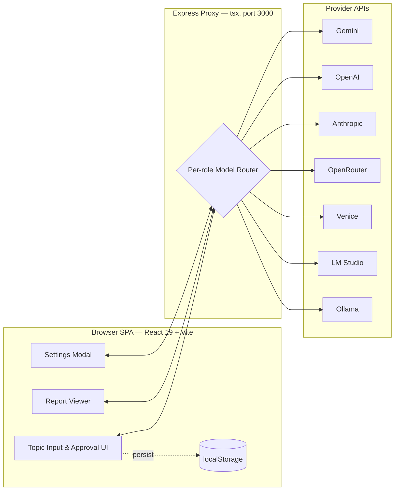
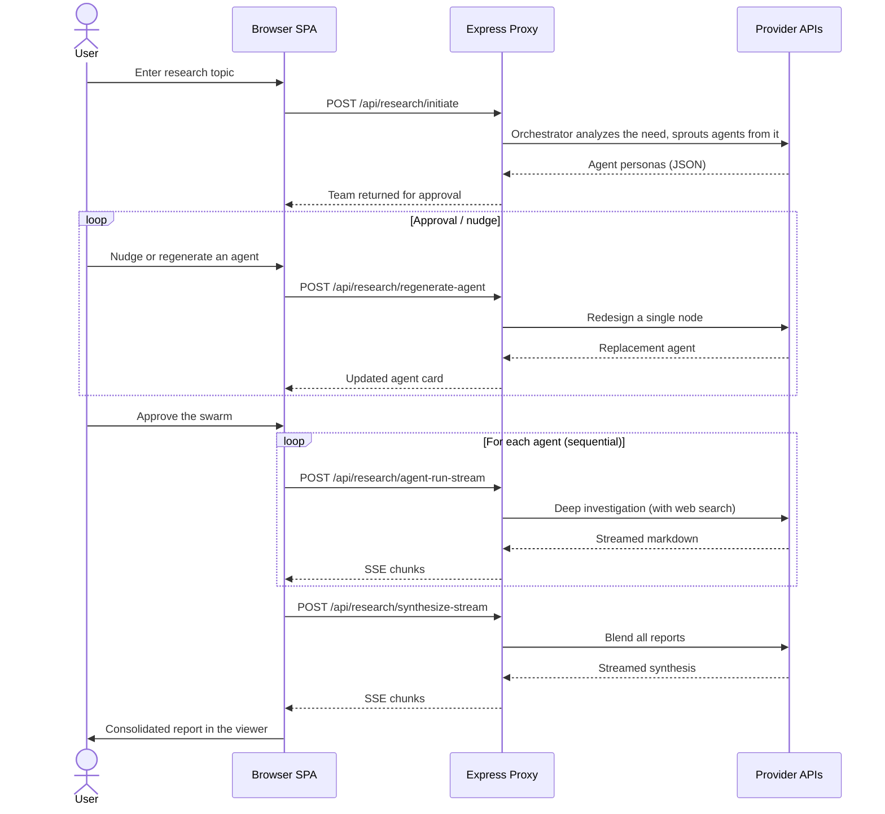
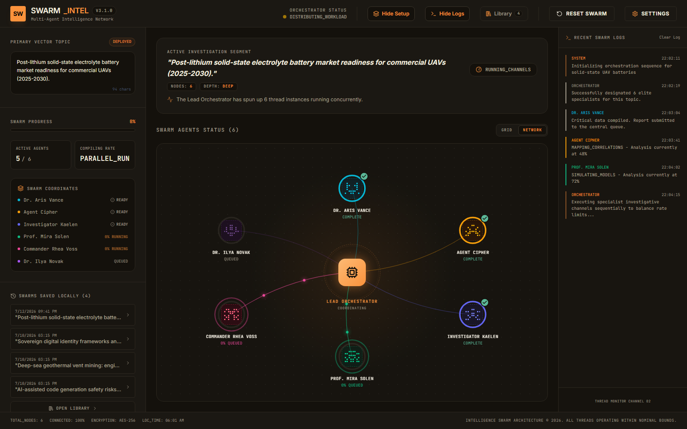
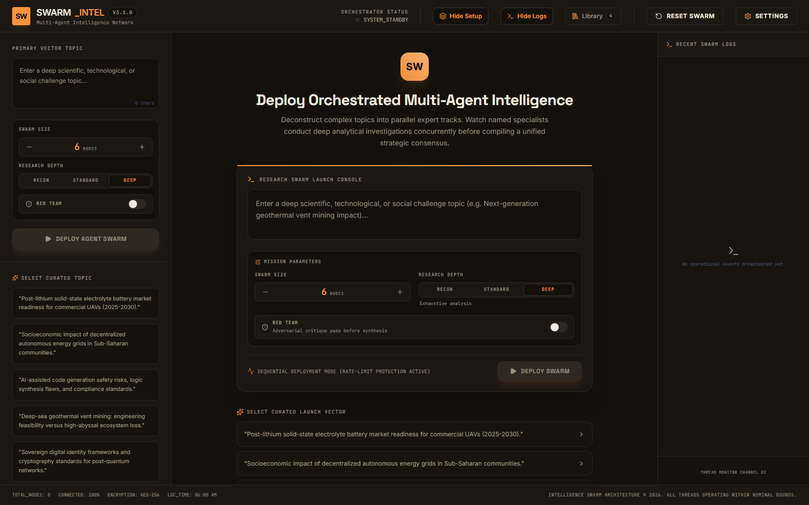
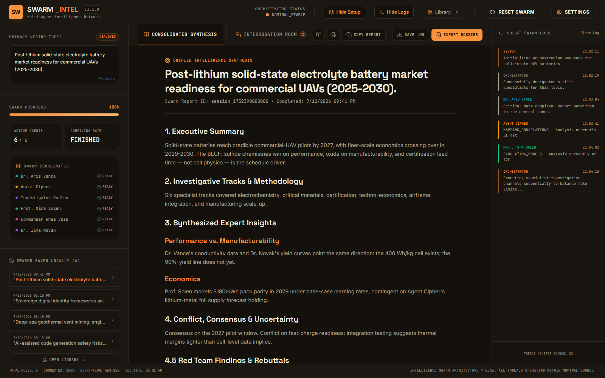
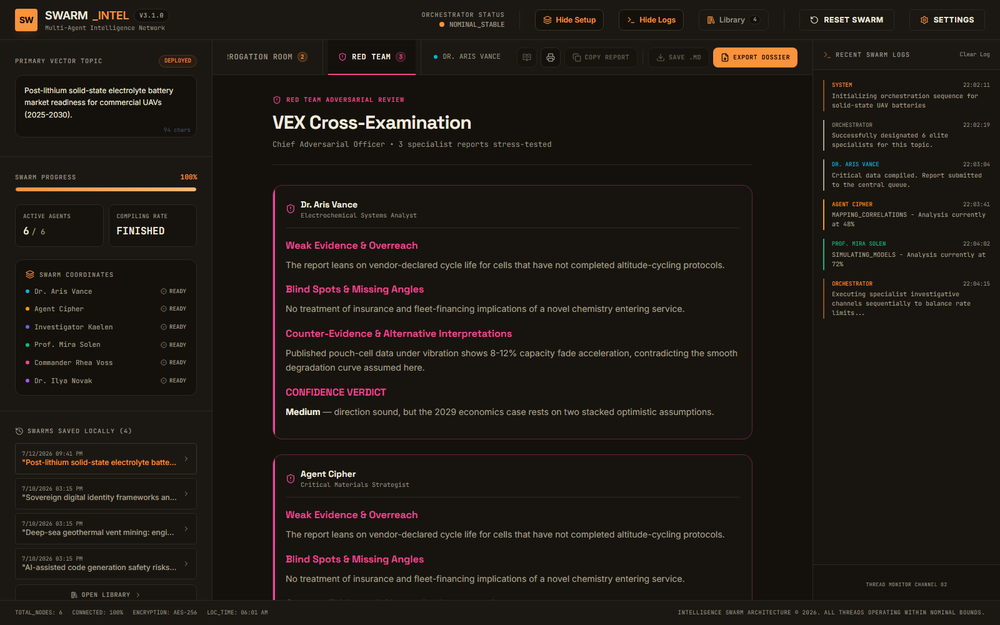
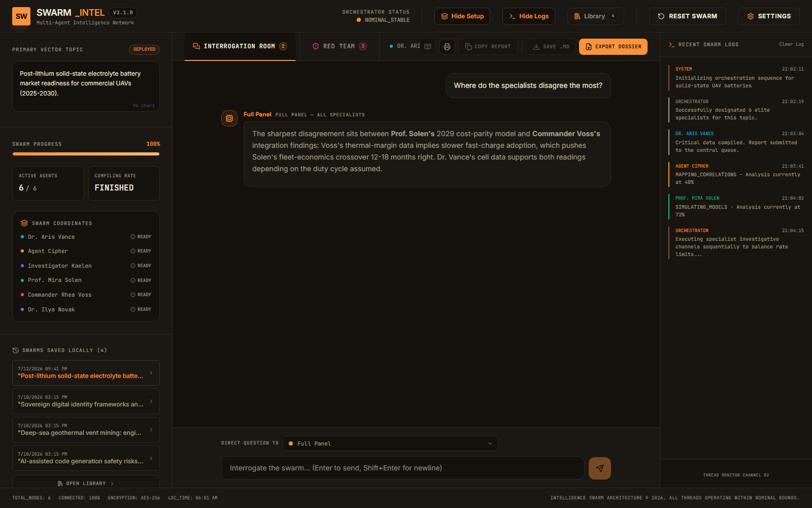
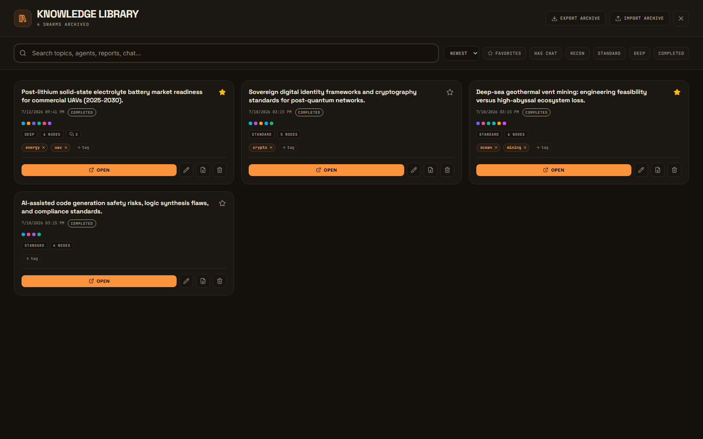

# Swarm Intel

**A local research swarm: assemble a team of specialist AI personas, run them in parallel, and synthesize their findings into one publication-grade report.**


> **Personal, local tool.** Swarm Intel runs as a single-user app on your own machine. It proxies your provider API keys through a local Express server and stores everything in browser `localStorage`. It is not hardened for multi-user or production deployment: no auth, no per-client rate limiting, no persistence layer beyond the browser.

---

## What is this?

You give Swarm Intel a research topic. An **orchestrator** model first diagnoses what the research need actually requires (its "mission analysis"), then sprouts a bespoke team of named specialist agents from that diagnosis — as many as the need demands in AUTO mode, or a pinned count of 3–9. You review and refine that team, then each agent runs a live-web-grounded investigation and streams back a markdown report. Finally, a **synthesis** pass blends every report into a single consolidated document.

- 🧠 **Orchestrated swarm assembly** — one prompt becomes a complementary team of 5 to 7 specialist personas, each with a role, an investigative angle, and a theme color.
- ✋ **Human-in-the-loop approval** — before any research runs, nudge an individual agent with a plain-language critique to regenerate just that node, or rebuild the whole team.
- 📡 **Live streaming reports** — each agent's report streams token-by-token over Server-Sent Events (SSE) into its own tab.
- 🐢 **Sequential execution by design** — agents run one at a time to stay under provider rate limits, with automatic retry and backoff on 429/503.
- 🔀 **Multi-provider, per-role routing** — mix and match Gemini, OpenAI, Anthropic, OpenRouter, Venice, LM Studio, and Ollama, and assign a different provider/model to the orchestrator, the agents, and the synthesis step.
- 🔒 **Keys stay server-side** — the browser never sees a provider key; every call is proxied through the local Express server.
- 💾 **Everything persists locally** — history, the current session, activity logs, and settings all live in `localStorage`.
- 🕸️ **Mission Control** — a live animated network view of the running swarm (Grid/Network toggle), with packet flows reversing toward the hub during synthesis.
- 🎛️ **Mission Parameters** — swarm size AUTO (need-driven) or pinned 3–9, plus research depth (Recon/Standard/Deep); recruit custom specialists or dismiss nodes at approval.
- 🌐 **Real web grounding on every provider** — Gemini, Anthropic, OpenRouter, and Venice use their native web search; LM Studio, Ollama, and plain OpenAI get live SearXNG results injected server-side (set `SEARXNG_BASE_URL` in `.env`). The ops log reports each agent's grounding mode, and warns when a run had no live data.
- 🔁 **Follow-up commissions** — from the Interrogation Room, launch a follow-up swarm that carries the prior run's synthesis and chat as established context. The new team targets the gaps instead of re-covering old ground, and its synthesis states what it adds, confirms, or overturns versus the prior report.
- 🛡️ **Red Team round** — optional adversarial pass where VEX cross-examines every report, and the synthesis must rebut or concede each critique.
- 👁️ **Fringe Mode** — case-file investigation for edge/esoteric territory: investigation-native specialists (FOIA hounds, insider-practitioners, anomaly cataloguers), non-mainstream sourcing (archives, declassified records, practitioner communities), provenance-tagged claims, and an Evidence Docket synthesis that keeps the case open — with structured Open Leads that follow-up commissions work like a real investigation. VEX becomes a chain-of-custody case auditor instead of a debunker.
- 💬 **Interrogation Room** — chat with the completed swarm, grounded strictly in its reports, panel-wide or specialist-in-persona.
- 📦 **Dossier Export Suite** — standalone HTML dossier, print-to-PDF paper theme, and a full-screen Reader Mode with auto-TOC.
- 🗂️ **Knowledge Library** — a searchable, taggable archive of up to 50 swarms with favorites, rename, and JSON backup/restore.

---

## 🏗️ Architecture

The browser SPA never talks to a provider directly. It calls the local Express server, which selects the right provider and model for each task role and forwards the request with your key attached.



### The research pipeline



---

## 📸 Screenshots

**Mission Control** — the live network view while a swarm runs: orchestrator hub, agent nodes with progress rings, and data packets flowing along the links.



**Launch Console** — topic entry with Mission Parameters: swarm size, Recon/Standard/Deep research depth, and the Red Team toggle.



**Consolidated Synthesis** — the final blended report, including the Red Team Findings & Rebuttals section when the adversarial round ran.



**Red Team** — VEX, the Chief Adversarial Officer, cross-examines every specialist report with a confidence verdict before synthesis.



**Interrogation Room** — follow-up questions answered strictly from the session's intelligence, by the full panel or any specialist in persona.



**Knowledge Library** — the searchable archive of every swarm: full-text search, filters, tags, favorites, and JSON import/export.



---

## 🚀 Getting Started

### Prerequisites

- **Node.js 22+**
- A **Gemini API key** for the default configuration ([Google AI Studio](https://aistudio.google.com/apikey)). Other providers are optional and configured in the app's Settings modal.

### Install and run

```bash
# 1. Install dependencies
npm install

# 2. Configure your key
cp .env.example .env
#   then edit .env and set GEMINI_API_KEY

# 3. Start the dev server (Vite + Express, single process)
npm run dev
```

Open **http://localhost:3369** and enter a research topic. (The server starts probing at port 3369 — chosen to stay clear of common dev/Docker squatters on 3000 — and walks upward if it's taken; the console prints the final URL. Override with `PORT` in `.env`.)

> The server binds to `0.0.0.0`, so it is reachable from other devices on your LAN. Keep that in mind since your provider keys are proxied through it.

### Scripts

| Script | Command | Purpose |
| --- | --- | --- |
| `npm run dev` | `tsx server.ts` | Run Express with Vite in middleware mode (hot reload) on port 3369+. |
| `npm run build` | `vite build` + `esbuild` | Bundle the SPA and compile the server to `dist/server.cjs`. |
| `npm start` | `node dist/server.cjs` | Serve the production build (set `NODE_ENV=production`). |
| `npm run lint` | `tsc --noEmit` | Type-check the whole project. |
| `npm run clean` | `rm -rf dist server.js` | Remove build artifacts. |

---

## 🔌 Providers & Model Routing

Keys and base URLs are entered in the **Settings modal** (Providers tab). The server also exposes a "fetch models" call so the UI can test a connection and list the models each provider offers. The Gemini key can also come from the server's `.env`, which is why Gemini works out of the box.

| Provider | Auth | Default base URL | Notes |
| --- | --- | --- | --- |
| **Gemini** | API key (Settings or `GEMINI_API_KEY` in `.env`) | Google endpoint (built in) | Default provider. Agent runs use Google Search grounding. |
| **OpenAI** | API key (`Authorization: Bearer`) | `https://api.openai.com/v1` | Chat Completions API. |
| **Anthropic** | API key (`x-api-key`) | `https://api.anthropic.com/v1` | Messages API, `anthropic-version: 2023-06-01`. |
| **OpenRouter** | API key (`Authorization: Bearer`) | `https://openrouter.ai/api/v1` | OpenAI-compatible; aggregates many models. |
| **Venice** | API key (`Authorization: Bearer`) | `https://api.venice.ai/api/v1` | OpenAI-compatible. |
| **LM Studio** | none (local) | `http://localhost:1234/v1` | OpenAI-compatible local server. |
| **Ollama** | none (local) | `http://localhost:11434` | Local models via the OpenAI-compatible chat endpoint. |

### Routing roles

Each stage of the pipeline can be pointed at a different provider and model in the **Settings modal (Routing tab)**:

- **Orchestrator** — assembles the swarm and regenerates individual agents. Returns structured JSON, so a capable instruction-following model works best.
- **Agent** — runs each specialist's deep investigation. This is where most tokens are spent; on Gemini it uses web search grounding.
- **Synthesis** — merges all specialist reports into the final consolidated document.

A common setup is a fast, cheap model for the orchestrator and a stronger model for agents and synthesis. Everything falls back to Gemini (`gemini-3.5-flash`) if a role is left unconfigured.

---

## 🛰️ API Reference

All routes are served by `server.ts` on port 3369 (or the next free port above it).

| Method | Path | Purpose | Response |
| --- | --- | --- | --- |
| `GET` | `/api/health` | Liveness check; reports whether the server-side Gemini key is set. | JSON |
| `POST` | `/api/settings/fetch-models` | Test a provider connection and list its available models. | JSON |
| `POST` | `/api/research/initiate` | Orchestrator assembles 5 to 7 specialist agents for a topic. | JSON |
| `POST` | `/api/research/regenerate-agent` | Redesign a single agent, optionally guided by a user nudge. | JSON |
| `POST` | `/api/research/agent-run-stream` | Run one agent's deep investigation. | SSE |
| `POST` | `/api/research/synthesize-stream` | Blend all specialist reports into the final report. | SSE |
| `POST` | `/api/research/interrogate-stream` | Answer a follow-up question grounded in the session's reports, as the full panel or a single specialist in persona. | SSE |
| `POST` | `/api/research/redteam-stream` | VEX adversarial cross-examination of a single specialist report (weaknesses, blind spots, counter-evidence, confidence verdict). | SSE |
| `POST` | `/api/research/extract-claims` | Extract the Claim Atlas: the run's major factual claims mapped to the specialists that support or dispute each one, plus cited sources. | JSON |

The two streaming endpoints emit `data:` events with a `type` field of `ping`, `chunk`, `done`, or `error`. A 5-second `ping` keeps the connection alive during long generations.

---

## 📁 Project Structure

```
swarm-intel/
├── server.ts               # Express proxy: routing, retries, SSE streaming, all /api routes
├── src/
│   ├── App.tsx             # Single-page app: pipeline flow, approval UI, settings, viewer
│   ├── main.tsx            # React entry point
│   ├── types.ts            # Agent / ResearchSession / status types
│   ├── index.css           # Tailwind entry + styles
│   └── components/
│       ├── PixelAvatar.tsx # Generative agent avatars
│       └── SwarmNetwork.tsx # Mission Control network visualization
├── assets/
│   └── screenshots/        # Release screenshots
├── .env.example            # GEMINI_API_KEY, APP_URL
├── metadata.json           # App name and capability metadata
├── package.json
└── vite.config.ts
```

### Persistence

The app keeps state in the browser under these `localStorage` keys:

| Key | Contents |
| --- | --- |
| `research_swarm_settings` | Provider keys, base URLs, and per-role model routing. |
| `research_swarm_history` | Past research sessions. |
| `research_swarm_current_session` | The in-progress or last-viewed session. |
| `research_swarm_current_logs` | Activity log for the current session. |

---

## 🧰 Tech Stack

- **Frontend:** React 19, Vite 6, Tailwind CSS 4, `react-markdown`, `motion`, `lucide-react`
- **Server:** Express 4 run through `tsx`, `@google/genai` for the Gemini SDK, native `fetch` for every other provider
- **Language & tooling:** TypeScript 5.8, `esbuild` for the production server bundle

---

## 📓 Feature Log

| Version | Feature |
| --- | --- |
| v2.6.0 | Mission Control — live animated swarm network visualization (orchestrator hub, agent nodes, packet flows, live progress rings; Grid/Network toggle) |
| v2.7.0 | Swarm Config — mission parameters (swarm size 3–9, Recon/Standard/Deep depth modes honored by all three pipeline stages), custom specialist recruitment with live avatar preview, and node dismissal at approval |
| v2.8.0 | Interrogation Room — chat with the completed swarm: follow-up questions answered strictly from the reports, streamed live, with respondent selection (Full Panel synthesis voice or any specialist in persona); chats persist with the session |
| v2.9.0 | Dossier Export Suite — standalone styled HTML dossier export (cover, TOC, roster, all reports, interrogation transcript), print-to-PDF with a light paper theme, and a full-screen Reader Mode with auto-TOC, font sizing, and scroll progress; GFM tables now render everywhere (remark-gfm) |
| v3.0.0 | Knowledge Library — full-screen searchable archive of every swarm (full-text search with match locations, sort, favorite/depth/chat filters, tags, inline rename, two-step delete, direct dossier export, JSON archive import/export); history cap raised to 50 with favorite-preserving eviction |
| v3.1.0 | Red Team — optional adversarial critique round: VEX (Chief Adversarial Officer) cross-examines every specialist report live before synthesis (weak evidence, blind spots, counter-evidence, confidence verdicts); the synthesis must rebut or concede each critique in a dedicated Findings & Rebuttals section; live Tribunal UI + rose network-view state + Red Team tab in results |

---

## 📄 License

Released under the Apache-2.0 License.
